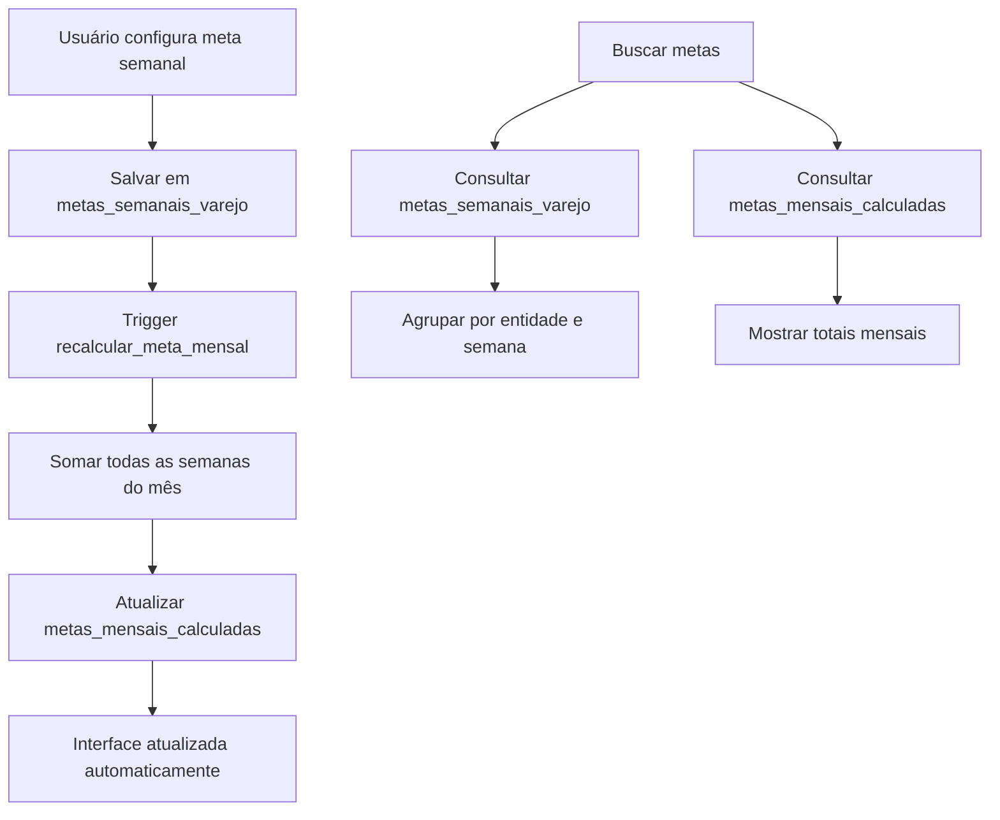

# 📅 Sistema de Metas Semanais - Documentação

## 🎯 **Visão Geral**

O Sistema de Metas Semanais permite configurar metas por semana que se somam automaticamente para formar a meta mensal. Cada semana pode ter metas separadas para Bronze, Prata, Ouro e Diamante.

## 🏗️ **Estrutura do Sistema**

### **1. Banco de Dados**

#### **Tabela: `metas_semanais_varejo`**

```sql
- id: Identificador único
- tipo: 'lojas' ou 'vendedores'
- nome: Nome da loja/vendedor
- semana_inicio: Data de início da semana (DATE)
- semana_fim: Data de fim da semana (DATE)
- campo: 'bronze', 'prata', 'ouro', 'diamante'
- valor: Valor numérico da meta (DECIMAL)
- mes_referencia: Mês de referência (YYYY-MM)
- numero_semana: Número da semana no mês (1-5)
- usuario: Usuário que criou/alterou
- data_alteracao: Timestamp da alteração
```

#### **Tabela: `metas_mensais_calculadas`**

```sql
- id: Identificador único
- tipo: 'lojas' ou 'vendedores'
- nome: Nome da entidade
- mes: Mês de referência (YYYY-MM)
- bronze: Total Bronze do mês (soma das semanas)
- prata: Total Prata do mês (soma das semanas)
- ouro: Total Ouro do mês (soma das semanas)
- diamante: Total Diamante do mês (soma das semanas)
- calculado_em: Quando foi calculado
- usuario: Usuário do sistema
```

### **2. Funcionalidades Automáticas**

#### **Trigger de Recalculo**

- **Automático**: Sempre que uma meta semanal é inserida/atualizada/deletada
- **Recalcula**: A meta mensal correspondente automaticamente
- **Mantém**: Histórico de alterações

#### **Funções Auxiliares**

- `obter_inicio_semana()`: Calcula primeira-feira da semana
- `obter_fim_semana()`: Calcula domingo da semana
- `obter_numero_semana_mes()`: Calcula número da semana (1-5)

## 🎨 **Interface do Usuário**

### **1. Estrutura Visual**

```
📅 METAS SEMANAIS - 2024-01
├── 🏪 LOJA: CROSBY SHOPPING
│   ├── 📊 META MENSAL TOTAL: R$ 200.000,00 (Soma das 4 semanas)
│   └── 📅 SEMANAS:
│       ├── SEMANA 1 (01/01 a 07/01)
│       │   ├── 🥉 Bronze: R$ 12.500,00
│       │   ├── 🥈 Prata: R$ 25.000,00
│       │   ├── 🥇 Ouro: R$ 37.500,00
│       │   └── 💎 Diamante: R$ 50.000,00
│       ├── SEMANA 2 (08/01 a 14/01)
│       ├── SEMANA 3 (15/01 a 21/01)
│       └── SEMANA 4 (22/01 a 31/01)
│
├── 🏪 LOJA: CROSBY VILLA LOBOS
└── 🏪 LOJA: CROSBY IBIRAPUERA
```

### **2. Componentes**

#### **MetasSemanaisModal**

- Modal para configurar metas de uma entidade específica
- Interface intuitiva com cards para cada semana
- Cálculo automático do total mensal

#### **MetasSemanaisView**

- Visualização principal das metas semanais
- Cards para cada entidade (loja/vendedor)
- Resumo mensal calculado automaticamente

#### **MetasVarejoSemanal**

- Página principal do sistema
- Filtros avançados
- Integração com dados existentes

## 🔧 **Como Usar**

### **1. Configuração Inicial**

```bash
# 1. Execute o schema SQL
psql -f supabase_schema_semanal.sql

# 2. Importe os componentes
import MetasVarejoSemanal from './pages/MetasVarejoSemanal';
```

### **2. Configurar Metas**

```javascript
// 1. Acesse a página de metas semanais
<MetasVarejoSemanal />

// 2. Selecione o período (mês)
// 3. Escolha lojas ou vendedores
// 4. Clique em "Configurar" para uma entidade
// 5. Defina metas para cada semana
// 6. Salve - as metas mensais são calculadas automaticamente
```

### **3. Exemplo de Dados**

```javascript
// Metas semanais para Janeiro 2024
const metasSemanais = [
  {
    tipo: 'lojas',
    nome: 'CROSBY SHOPPING',
    semana_inicio: '2024-01-01',
    semana_fim: '2024-01-07',
    numero_semana: 1,
    metas: {
      bronze: 12500,
      prata: 25000,
      ouro: 37500,
      diamante: 50000,
    },
  },
  // ... outras semanas
];

// Meta mensal calculada automaticamente
const metaMensal = {
  tipo: 'lojas',
  nome: 'CROSBY SHOPPING',
  mes: '2024-01',
  bronze: 50000, // Soma das 4 semanas
  prata: 100000, // Soma das 4 semanas
  ouro: 150000, // Soma das 4 semanas
  diamante: 200000, // Soma das 4 semanas
};
```

## 📊 **Fluxo de Dados**



## 🎯 **Vantagens do Sistema**

### **1. Flexibilidade**

- ✅ Metas diferentes para cada semana
- ✅ Ajustes semanais conforme sazonalidade
- ✅ Estratégias de vendas por período

### **2. Automatização**

- ✅ Cálculo automático de metas mensais
- ✅ Triggers para manter consistência
- ✅ Histórico completo de alterações

### **3. Performance**

- ✅ Índices otimizados
- ✅ Views para consultas rápidas
- ✅ Cache de metas calculadas

### **4. Usabilidade**

- ✅ Interface intuitiva
- ✅ Visualização clara por semana
- ✅ Resumo mensal automático

## 🔄 **Migração do Sistema Atual**

### **1. Manter Compatibilidade**

```javascript
// O sistema atual continua funcionando
// As metas mensais antigas são preservadas
// Novo sistema roda em paralelo
```

### **2. Gradual**

```javascript
// 1. Implementar sistema semanal
// 2. Migrar entidades gradualmente
// 3. Descontinuar sistema antigo quando necessário
```

## 📈 **Exemplos de Uso**

### **1. Sazonalidade**

```
Janeiro: Semana 1 (pós-Natal) - Metas menores
         Semana 2-4 - Metas normais

Dezembro: Semana 1-3 - Metas normais
          Semana 4-5 - Metas altas (Natal)
```

### **2. Estratégias por Semana**

```
Semana 1: Foco em Bronze (clientes novos)
Semana 2: Foco em Prata (clientes recorrentes)
Semana 3: Foco em Ouro (vendas premium)
Semana 4: Foco em Diamante (grandes vendas)
```

### **3. Campanhas Especiais**

```
Semana com promoção: Meta Bronze dobrada
Semana sem estoque: Meta Prata reduzida
Black Friday: Todas as metas aumentadas
```

## 🛠️ **Manutenção**

### **1. Monitoramento**

```sql
-- Verificar metas não configuradas
SELECT * FROM metas_mensais_calculadas
WHERE bronze = 0 AND prata = 0 AND ouro = 0 AND diamante = 0;

-- Verificar inconsistências
SELECT * FROM metas_semanais_varejo
WHERE valor < 0 OR valor > 1000000;
```

### **2. Backup**

```sql
-- Backup das metas semanais
COPY metas_semanais_varejo TO '/backup/metas_semanais.csv' CSV HEADER;

-- Backup das metas mensais calculadas
COPY metas_mensais_calculadas TO '/backup/metas_mensais.csv' CSV HEADER;
```

## 🚀 **Próximos Passos**

1. **Implementar relatórios** de performance semanal
2. **Adicionar alertas** para metas não atingidas
3. **Criar dashboards** comparativos entre semanas
4. **Integrar com BI** para análises avançadas
5. **Mobile app** para gestão de metas em campo

---

**Sistema desenvolvido para máxima flexibilidade e usabilidade! 🎯**
