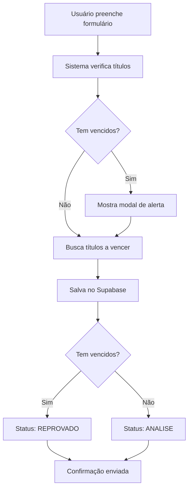

# Solicitações de Crédito - Documentação

## 📋 Estrutura da Tabela `solicitacoes_credito`

### Campos Principais

| Campo             | Tipo          | Descrição                                                   |
| ----------------- | ------------- | ----------------------------------------------------------- |
| `id`              | UUID          | Identificador único da solicitação                          |
| `cd_empresa`      | INTEGER       | Código da empresa/franquia                                  |
| `nm_empresa`      | TEXT          | Nome da empresa                                             |
| `cd_pessoa`       | INTEGER       | Código da pessoa (cliente)                                  |
| `vl_credito`      | DECIMAL(15,2) | Valor do crédito solicitado                                 |
| `forma_pagamento` | TEXT          | Forma de pagamento (boleto, credito, debito, dinheiro, pix) |
| `nr_parcelas`     | INTEGER       | Número de parcelas (1-12)                                   |
| `motivo`          | TEXT          | Motivo detalhado da solicitação                             |

### Arrays JSON

#### `titulos_vencidos` (JSONB)

Array contendo todos os títulos vencidos no momento da solicitação:

```json
[
  {
    "nr_fat": 12345,
    "nr_parcela": 1,
    "dt_vencimento": "2025-11-15",
    "vl_fatura": 1500.0,
    "cd_situacao": 1,
    "dt_emissao": "2025-10-15",
    "cd_cliente": 100,
    "cd_empresa": 1
  }
]
```

#### `titulos_a_vencer` (JSONB)

Array contendo todos os títulos a vencer (futuros) no momento da solicitação:

```json
[
  {
    "nr_fat": 12346,
    "nr_parcela": 1,
    "dt_vencimento": "2025-12-15",
    "vl_fatura": 2000.0,
    "cd_situacao": 1,
    "dt_emissao": "2025-11-15",
    "cd_cliente": 100,
    "cd_empresa": 1
  }
]
```

### Dados do Solicitante

| Campo        | Tipo | Descrição                           |
| ------------ | ---- | ----------------------------------- |
| `user_id`    | UUID | ID do usuário que fez a solicitação |
| `user_email` | TEXT | Email do solicitante                |
| `user_nome`  | TEXT | Nome do solicitante                 |

### Controle e Status

| Campo               | Tipo        | Valores Possíveis                  | Descrição                           |
| ------------------- | ----------- | ---------------------------------- | ----------------------------------- |
| `status`            | TEXT        | `ANALISE`, `APROVADO`, `REPROVADO` | Status da solicitação               |
| `dt_solicitacao`    | TIMESTAMPTZ | -                                  | Data e hora da solicitação          |
| `dt_aprovacao`      | TIMESTAMPTZ | -                                  | Data e hora da aprovação/reprovação |
| `aprovado_por`      | UUID        | -                                  | ID do usuário que aprovou/reprovou  |
| `motivo_reprovacao` | TEXT        | -                                  | Motivo da reprovação (se aplicável) |

### Auditoria

| Campo        | Tipo        | Descrição                   |
| ------------ | ----------- | --------------------------- |
| `created_at` | TIMESTAMPTZ | Data de criação do registro |
| `updated_at` | TIMESTAMPTZ | Data da última atualização  |

## 🔄 Lógica de Status

### Regras Automáticas

1. **REPROVADO Automático**:

   - Se houver títulos vencidos (`titulos_vencidos.length > 0`)
   - Status definido automaticamente como `REPROVADO`
   - Ainda assim, TODAS as informações são salvas no banco

2. **EM ANÁLISE**:

   - Se NÃO houver títulos vencidos
   - Status definido como `ANALISE`
   - Aguarda aprovação manual de usuário master

3. **APROVADO**:
   - Somente usuários master podem aprovar
   - Implementação futura

## 🔒 Segurança (RLS - Row Level Security)

### Políticas Configuradas

1. **SELECT**: Usuários podem ver apenas suas próprias solicitações
2. **INSERT**: Usuários podem criar solicitações para si mesmos
3. **UPDATE**: Apenas administradores podem atualizar (aprovar/reprovar)

## 📊 Índices

- `idx_solicitacoes_credito_cd_empresa`: Busca por empresa
- `idx_solicitacoes_credito_user_id`: Busca por usuário
- `idx_solicitacoes_credito_status`: Filtragem por status
- `idx_solicitacoes_credito_dt_solicitacao`: Ordenação por data

## 🎯 Exemplos de Consultas

### Buscar solicitações do usuário logado

```sql
SELECT * FROM solicitacoes_credito
WHERE user_id = auth.uid()
ORDER BY dt_solicitacao DESC;
```

### Buscar solicitações por status

```sql
SELECT * FROM solicitacoes_credito
WHERE status = 'ANALISE'
ORDER BY dt_solicitacao ASC;
```

### Buscar solicitações com títulos vencidos

```sql
SELECT * FROM solicitacoes_credito
WHERE jsonb_array_length(titulos_vencidos) > 0;
```

### Total de crédito solicitado por empresa

```sql
SELECT
  cd_empresa,
  nm_empresa,
  COUNT(*) as total_solicitacoes,
  SUM(vl_credito) as total_credito
FROM solicitacoes_credito
GROUP BY cd_empresa, nm_empresa
ORDER BY total_credito DESC;
```

## 🚀 Como Executar o SQL

1. Acesse o Supabase Dashboard
2. Vá em **SQL Editor**
3. Copie o conteúdo do arquivo `schema-solicitacoes-credito.sql`
4. Execute o script
5. Verifique se a tabela foi criada com sucesso

## 📝 Fluxo da Aplicação



## ⚠️ Validações Importantes

1. **Data de Liquidação**: Se `dt_liquidacao` está preenchida, o título não é considerado vencido
2. **Valor Pago**: Se `vl_pago > 0`, o título não é considerado vencido
3. **Código de Situação**: Se `cd_situacao = 4` (pago), o título não é considerado vencido
4. **Títulos A Vencer**: Apenas títulos com `dt_vencimento >= hoje` e não pagos

## 🔧 Próximos Passos

- [ ] Implementar painel de aprovação para usuários master
- [ ] Adicionar notificações por email
- [ ] Criar dashboard com estatísticas
- [ ] Implementar histórico de alterações de status
- [ ] Adicionar comentários/observações na análise
